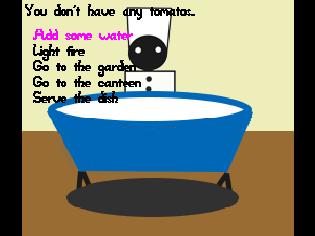

Listen to the Crazy Restaurant

Author: 

Xuechun Luo

Design: 

The cooker need to hear the feedback sound from the customer and pay attention to the sound of the pot to decide whether the dish is well done.

Screen Shot:

How To Play:

The customer is waiting for something to eat. You need to make some choices and try cook something on your kitchen then give it to the customer to hear his feedback. When cooking, wait until you hear the water boiling to make sure the dish is done.

Sources:

(All free download sound resources for study purpose, thanks to www.aigei.com, sc.chinaz.com)

water-cook.wav: http://www.aigei.com/item/shao_shui.html

cook-done.wav: http://www.aigei.com/sound/class/train_whistle-wav/

relaxing.wav: http://www.aigei.com/music/class/easy/  	[Relaxing-轻松的事_Version_A-Guitar_Full]

teafortwo.wav: http://www.aigei.com/music/class/easy/  	[TeaForTwo-两杯茶_Version_B-SynthBells_Full]

wow.wav: http://www.aigei.com/sound/class/applause  [哇呜1]

ho-no.wav: http://sc.chinaz.com/yinxiao/121222392410.htm#down 

This game was built with [NEST](NEST.md).

